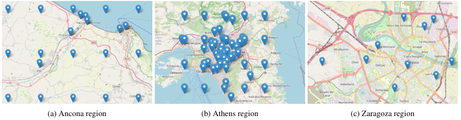

# Regional Datasets for Air Quality Monitoring in European Cities

by
_Georgios-Fotios Angelis,
Alexandros Emvoliadis,
Traianos-Ioannis Theodorou, 
Alexandros Zamichos,
Anastasios Drosou
and Dimitrios Tzovaras_

Accepted as an oral presentation paper in the **IGARSS 2024**.

This repository contains the data and source code used to produce the results of the paper

Data can be downloaded from here: [dataset link](https://zenodo.org/records/10579172)

## Overview

### Abstract

The primary environmental health threat in the WHO European Region is air pollution, impacting the daily health and
well-being of its citizens significantly. To effectively understand the impact, and dynamics of air quality a detailed investigation of different environmental, weather, and land cover
indices is appropriate. To this end, this paper introduces three
European cities’ spatiotemporal datasets, customized for air
pollution monitoring at a regional level. The datasets are composed of major air quality, weather measurements and land use
information. The duration is approximately from 2020 to 2023
with an hourly temporal resolution and a spatial resolution of
0.005◦. The temporal and spatiotemporal datasets are publicly
released aiming to provide a solid foundation for researchers,
analysts, and practitioners to conduct in-depth analyses of air
pollution dynamics.

### Motivation
Detailed monitoring of pollutant variables provides valuable insights into human activities impacting air quality and pollution sources. Advancements in sensor technologies, satellites, UAVs, and data analysis tools have enhanced the quality and quantity of air quality data, enabling better decision-making and analysis. However, creating air quality datasets is time-consuming, requiring significant effort. To address these challenges, we aggregate data from diverse sources to provide high-quality air pollution data enriched with contextual information.
 
### Approach

### Contributions
In summary we make the following contributions:
- We have collected and aligned diverse air quality data from three
European cities, offering high temporal accuracy (onehour resolution) for detailed analysis and low spatial
resolution for regional monitoring.
- We have enhanced data through anomaly detection and imputation, producing three ready-to-use datasets for air quality
modeling.
- We have integrated land usage features, revealing insights into
the link between urban development, land use, and air
quality.

## File Download Script

This repository contains a bash script to download three CSV files and move them into a `data` directory.

### Files

- [athens.csv](https://zenodo.org/record/11220965/files/athens.csv)
- [ancona.csv](https://zenodo.org/record/11220965/files/ancona.csv)
- [zaragoza.csv](https://zenodo.org/record/11220965/files/zaragoza.csv)

### Script Description

The provided bash script:
1. Prints a message indicating that downloads are starting.
2. Downloads the three specified CSV files.
3. Creates a `data` directory if it doesn't already exist.
4. Moves the downloaded files into the `data` directory.
5. Prints a message indicating that the downloads and file moves are complete.

[//]: # (### Usage)

## License

All Python source code (including `.py` and `.ipynb` files) is made available
under the MIT license. You can freely use and modify the code, without
warranty, so long as you provide attribution to the authors. See
`LICENSE-MIT.txt` for the full license text.

[cc-by]: https://creativecommons.org/licenses/by/4.0/
